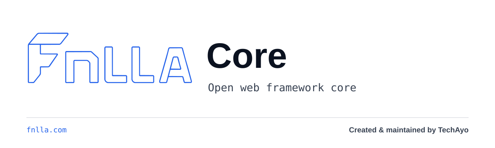

# FNLLA Core



FNLLA Core is the open PHP framework core used by FNLLA. It carries the same
FNLLA identity system and maintainer attribution, with a framework-first promise:
runtime primitives, routing, HTTP, container, validation, database, session,
cache, mail, queue and core CLI building blocks.

Package: `techayodev/fnlla-core`
Repository: `techayoDEV/fnlla-core`
Candidate version: `2.3.0-rc.2` (local review only; not published or
release-approved). The published baseline remains `2.2.4`.

## FNLLA Family

There are two public FNLLA tracks:

- **FNLLA Core** - this repository, the open PHP framework core package.
- **FNLLA** - the full product and application platform repository:
  `techayoDEV/fnlla`.

[fnlla.com](https://fnlla.com) is the public website and documentation hub that
ties FNLLA Core and FNLLA together.

## Origin And Maintainers

The FNLLA name comes from Finella Gardens in Dundee, Scotland, where the idea
for the framework began.

FNLLA Core is created and maintained by **TechAyo**.

Lead Developer / Product Manager - **Marcin Kordyaczny**.

Official public sources are the GitHub repositories under `techayoDEV` and
[fnlla.com](https://fnlla.com).

## Scope

FNLLA Core is for framework-level code and package consumers who need the base
runtime. The full FNLLA product builds on Core with the broader application
platform, project workflow and public website experience.

Core includes framework CLI commands for controllers, middleware, commands,
factories, seeders, migrations, migration execution, route inspection, route
cache, config cache, queues, database seeding and framework upgrades.

Core also includes a limited `make:project` command. It creates a minimal public
FNLLA Core application from this repository only. The full FNLLA repository owns
the broader platform profile and project tooling.

## Install

Install from the public GitHub VCS repository:

```powershell
composer config repositories.fnlla-core vcs https://github.com/techayoDEV/fnlla-core.git
composer require techayodev/fnlla-core:~2.2.0
```

The package autoloads `Fnlla\Php\` from `src/` and includes the shared helper
file from `src/Support/helpers.php`.

## Create A Core Project

From a clone of this repository:

```powershell
php fnlla make:project ../my-core-app "My Core App"
```

The generated project includes a small public homepage, routing, config,
tests, lint/static-analysis scripts, the `fnlla` CLI launcher and a local
`packages/fnlla-core` path package. It does not create the full FNLLA platform
application; use `techayoDEV/fnlla` when you need that profile.

## Validate

```powershell
php scripts/test.php
php scripts/lint.php
php scripts/static-analysis.php
```

## Queue And Runtime Inspection

Queue jobs use the `fnlla.queue.v1` envelope and must be registered in
`queue.job_types`. File and Redis stores use reservations, expiring leases,
bounded retries and durable idempotency markers. Delivery remains at-least-once:
job handlers must recheck permission and lease validity immediately before an
external effect. FNLLA does not promise exactly-once mail, API or payment effects.

The published `QueueStoreInterface` remains the six-method Core v2.2.4 contract
for basic third-party stores. Core's file and Redis stores additionally implement
`ReliableQueueStoreInterface`, which is required for versioned metadata,
`JobContext`, tenant-aware work, lease ownership/renewal and durable idempotency.
A legacy store is called with the original two-argument `push()` signature and
may run only the basic non-contextual flow. Supplying dispatch context or enabling
tenant-aware work without the reliable capability fails before a job is written
or reserved; metadata is never silently discarded.

Run `php fnlla queue:work [max-jobs] [max-seconds]` for a bounded worker and
`php fnlla runtime:inspect` for versioned, redacted local diagnostics. Use
`DatabaseManager::afterCommit()` or the queue/event/mail `*AfterCommit` methods
inside managed transactions; rollback discards deferred callbacks.

## Product Specification

Core ships the neutral `fnlla.product.v1` JSON contract, related evidence,
drift and derived-graph schemas, and synthetic examples under
`resources/product-specification/`. These declarations do not register routes
or prove runtime behavior. Validate a specification and optional module
declarations with:

```powershell
php fnlla product:validate path/to/product.json --module=path/to/module.json
```

The JSON report uses `fnlla.product-validation-report.v1`; a valid declaration
still reports runtime evidence as `not_evaluated`. See
[the Product Specification contract](docs/framework/PRODUCT-SPECIFICATION.md).

## Product Modules

Applications may configure one Product Specification, its complete
`fnlla.module.v1` manifest set and trusted PHP extension classes in
`config/product_modules.php`. The registry validates the same K-04 contract,
resolves dependencies, detects service/route collisions and uses the existing
Container and Router extension points. JSON never names an executable provider
or command.

```powershell
php fnlla module:validate
php fnlla module:list
php fnlla module:inspect work-orders
php fnlla module:enable work-orders
php fnlla module:disable work-orders
```

Enabling a module enables its dependencies. Disabling an active dependency is
refused. Disable is not uninstall: application data and declared assets are
preserved, module routes are omitted immediately, and removal remains an
owner-reviewed or package-manager operation.

## Authorization, Tenancy And Audit

Core includes deny-by-default role/permission and resource-policy primitives,
server-resolved tenant context, explicit tenant-scoped adapters for repositories,
cache, files, exports and tools, and a versioned allowlist-based audit event.
These controls do not require the FNLLA Developer Panel.

The default `TENANCY_MODE=none` preserves single-tenant behavior. For
`organization` or `custom`, use the `tenant` middleware on scoped routes and
migrate every application-owned data boundary deliberately. Queue dispatch
copies the active authoritative context, and workers revalidate actor access
before handling. See
[Security primitives](docs/framework/SECURITY-PRIMITIVES.md) before enabling a
multi-tenant mode.

## Actions And Domain Events

`ActionRunner` derives actor, tenant, source and correlation from trusted runtime
context, enforces permission/policy before validation, and records the domain
mutation, idempotency receipt, audit and versioned domain events in one managed
transaction. Audit/event relay begins only after commit; rollback publishes no
success. The application must install the reference InnoDB receipt/outbox schema
through a reviewed migration.

Queued listeners inherit actor, tenant, correlation and event idempotency data.
Delivery remains at-least-once, so external-effect handlers must use the event ID
as a business/provider idempotency key. See
[Actions and domain events](docs/framework/ACTIONS-AND-DOMAIN-EVENTS.md).

## Documentation

- [Core package docs](docs/README.md)
- [Runtime contracts](docs/framework/RUNTIME-CONTRACTS.md)
- [Product Specification](docs/framework/PRODUCT-SPECIFICATION.md)
- [Security primitives](docs/framework/SECURITY-PRIMITIVES.md)
- [Actions and domain events](docs/framework/ACTIONS-AND-DOMAIN-EVENTS.md)
- [Trademark notice](docs/framework/TRADEMARKS.md)
- [Support boundary](docs/framework/SUPPORT.md)
- [Security policy](SECURITY.md)

## Branding

FNLLA Core uses the same outline mark, Blueprint Blue palette and TechAyo
attribution as FNLLA. When this repository is shown on its own, use the name
**FNLLA Core** and the Core-specific lockup in `branding/assets/logo/`.

The canonical brand notes live in [branding/README.md](branding/README.md) and
[branding/BRAND-GUIDE.md](branding/BRAND-GUIDE.md). Keep package names,
commands and namespaces literal, especially `techayodev/fnlla-core` and
`Fnlla\Php\`.

## Maintenance

This repository is generated from the maintained FNLLA source manifest. Keep
changes aligned with the public framework-core scope so the package remains
clear, reusable and professional on its own.
