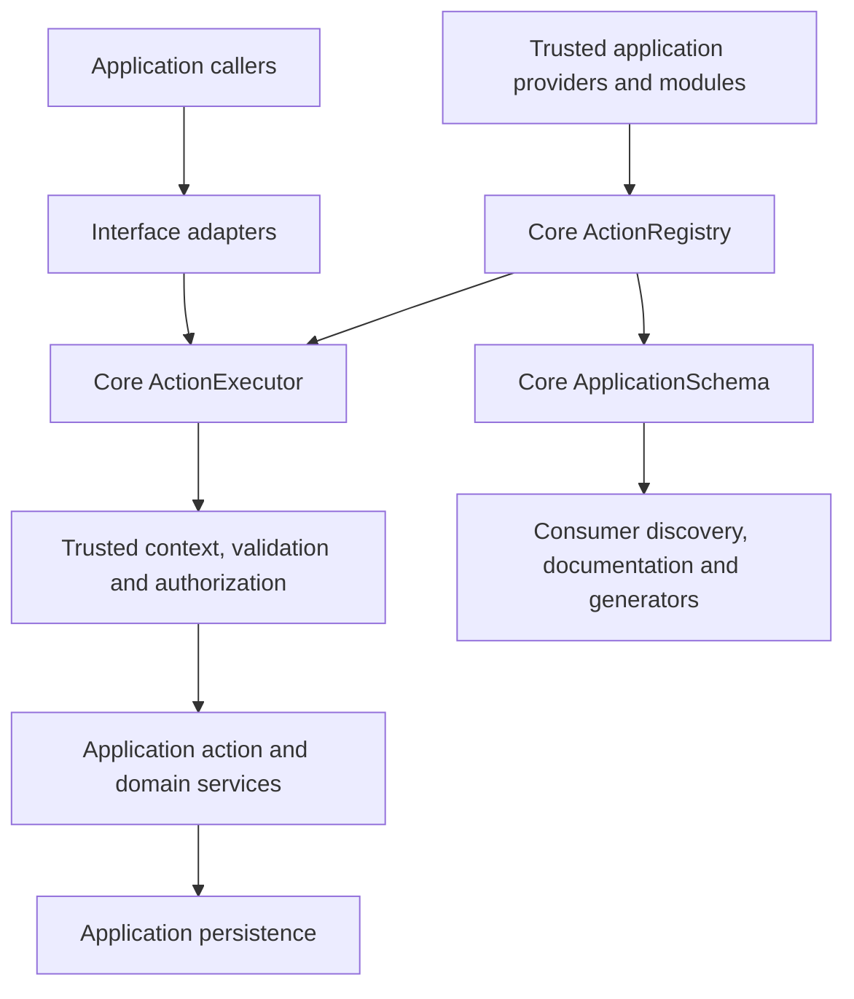

# Architecture and responsibility boundaries

[Documentation index](../README.md) · Applies to Core 2.5.0

FNLLA Core supplies the PHP runtime and reusable application contracts.
Applications define business behavior. FNLLA Full consumes Core and provides
additional developer tooling and capability adapters. Core has no dependency
on Full, an AI provider or a hosted FNLLA service.

## Execution model

An action is an application operation with an identifier, permission and handler.
Adding `ActionMetadata` makes its input, output and execution semantics available
as a capability. The registry stores definitions; it does not discover database
models or infer business policy.

Adapters map their own request format to `ActionExecutor::execute()`. They must
obtain a trusted context, preserve Core's permission checks and map safe failures
to their protocol. Business rules belong in action handlers and domain services.

## Core, application and Full

| Concern | Core | Application / Full |
| --- | --- | --- |
| Runtime | Container, HTTP primitives, routing, validation, persistence adapters | Application bootstrap, routes and chosen infrastructure |
| Capabilities | Registry, metadata, executor, bounded shapes and schema projection | Domain identifiers, handlers, policies and explicit exposure choices |
| Identity | Authentication, authorization and tenant contracts | User provider, membership rules and authenticated entry points |
| Mutations | Managed transactions, receipts, audit and outbox primitives | Business writes, migrations, event declarations and retention |
| REST discovery | Routing primitives and safe application schema | Full's explicit REST bindings, `/.fnlla`, `/api/schema`, `/api/openapi` |
| CLI | Console primitives and runtime/maintenance commands | Full's capability `action` adapter and application-specific commands |
| MCP | Transport-independent capability execution | Full's optional MCP adapter and application-owned approval policy |
| SDK | Machine-readable capability definitions | Full generation tooling; generated clients run outside Core |
| Webhooks | Domain events, outbox and reliable queue contracts | Full's optional signed delivery and application-approved subscriptions |
| Developer Panel | No panel dependency | Full owns the panel and its separate developer identity |

Core also supports ordinary controllers and explicit route OpenAPI annotations.
Using capabilities is an application architecture choice; legacy Actions remain
supported. Core's `openapi:export` exports annotated routes. It is distinct from
Full's capability-derived `/api/openapi` projection.

## Bootstrap and registration

1. The entry point resolves the application root and installed engine root.
2. Shared bootstrap loads configuration and creates the container.
3. Providers from `config/app.php` register bindings, then boot in a second pass.
4. Enabled Product Modules register trusted services and optional actions.
5. HTTP dispatch or CLI execution uses those same definitions.

Application code lives in `App\`; runtime contracts live in `Fnlla\Php\`.
`APP_ROOT` and `FNLLA_ENGINE_ROOT` may point to different directories.
Register a capability once, through its owning provider or module. Product JSON
is declarative data and cannot supply executable handler classes.

## Query and command semantics

| Property | Query | Command |
| --- | --- | --- |
| `ActionMetadata::kind` | `query` | `command` (default) |
| Handler result | Shape-compatible array | `ActionMutation` |
| Transaction opened by executor | No | Managed database transaction |
| Receipt and domain outbox | None | Included in the mutation transaction |
| Declared mutation events | Rejected | Explicitly declared event names |
| Identity domains | Explicitly allowed domains | `application` only in 2.5.0 |

A query handler must be read-only by application design; Core does not sandbox
SQL or filesystem writes. Commands require the reviewed receipt/outbox schema.
Database rollback cannot undo an immediate external request. Schedule external
effects after commit and make delivery idempotent.

## Metadata and trust

`ApplicationSchema::describe($context)` is a caller-filtered projection. It
excludes hidden fields and executable implementation details. Resource-specific
authorization still happens when an action executes. `inspect()` is the local
maintainer view and must not become an unfiltered discovery endpoint.

`public` means eligible for authorized use; it does not mean anonymous.
An internal capability remains internal even if a transport names its identifier.
AI tool inputs never establish user identity, tenant membership or human approval.

The schema's content hash detects changes to that projection. It is not a
signature, execution permission or release approval. Shape vocabulary is bounded
`fnlla.action-shape.v1`, not arbitrary JSON Schema.

## Compatibility and limits

- Metadata-bearing definitions execute through `ActionExecutor`; legacy ones
  continue through `ActionRunner`.
- Capability receipts are separate from legacy receipts. Retry with the same
  trusted correlation and normalized input; reauthorization still runs.
- Delivery is at-least-once. Idempotent handling is required for external effects.
- Tenant isolation must be applied at application data boundaries; raw SQL is
  not automatically tenant-scoped.
- Long-lived HTTP worker isolation and live module hot reload are not guaranteed.
- Full adapter availability is governed by its own source/release and configuration.
  Releasing Core does not enable endpoints or publish Full.

Continue with [capability contracts](CAPABILITIES.md),
[actions and events](ACTIONS-AND-DOMAIN-EVENTS.md),
[Product Modules](PRODUCT-SPECIFICATION.md), and [operations](OPERATIONS.md).
