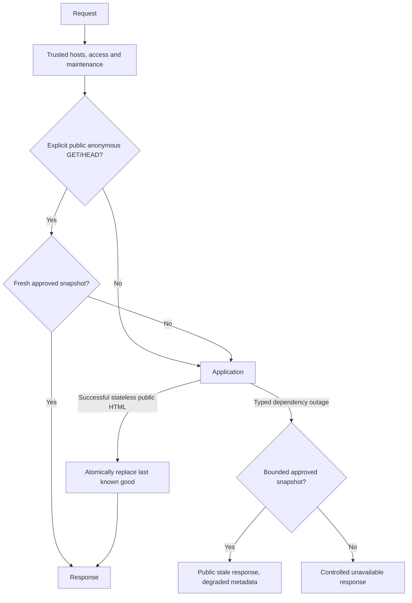

# FNLLA Resilience

## Status and ownership

These contracts are available in released Core 2.7.0. Resilience was introduced
in 2.6.0; install the matching immutable dependency before using newer contracts.
Core owns the provider-neutral runtime. Full owns compatibility/bootstrap
adapters; applications own approved public content and deployment rules.
Installed immutable dependencies must be upgraded through a reviewed versioned
artifact, never patched in `vendor/` or `packages/fnlla-core`.

Response caching and public health interception are opt-in. Safe production
errors, isolated instrumentation and the generic emergency entry guard provide
baseline protection. Resilience means preserving available functionality while
reporting broken functionality honestly; it does not guarantee uptime.

## Request flow



An exception during boot reaches the application entry's static 503 guard.
If PHP cannot execute, a configured web server/CDN must serve the emergency
artifact independently. Neither mechanism covers an unreachable host/proxy/DNS.

## Configure one resilience path

Use the application's `config/resilience.php`:

```php
'enabled' => true,
'page_cache' => [
    'enabled' => true,
    'paths' => ['/', '/loans', '/savings', '/contact', '/help'],
    'namespace' => 'public-v1',
    'fresh_ttl' => 300,
    'last_known_good_ttl' => 86400,
    'max_body_bytes' => 1048576,
],
'health' => [
    'enabled' => true,
    'snapshot_ttl' => 10,
    'dependencies' => ['database' => 'degradable', 'cache' => 'optional'],
],
```

Dependencies are critical, degradable or optional. A critical observed failure
is unavailable; another observed failure is degraded. These are observations,
not a replacement for the existing application capability/schema registry.
Declare database critical for services that cannot operate without it; declare
it degradable for a public informational site that can use approved LKG.

Readiness reflects declared dependencies, not undeclared business guarantees.
An empty health dependency list checks application boot only. `RuntimeDoctor`
supports bounded read-only database/cache/queue probes; custom service probes
need an application-owned adapter, not guessed readiness. No active health
probe runs on a normal page request.

## Public pages and last known good

Install `ResilienceMiddleware` after trust/access/maintenance middleware. Core
and Full starters wire this when enabled. Each approved controller must return
an explicitly public `Response`, after reviewing every included component:

```php
return Response::html($publicHtml, 200, ['X-FNLLA-Public-Page' => '1']);
```

Only 200 HTML with the marker, no session, Set-Cookie, Vary, private/no-store,
forms/CSRF tokens or CSP nonce is persisted. Request cookies, Authorization,
query strings, language variants, Range, JSON/XHR and noncanonical host requests
are excluded. Methods must originally be GET/HEAD; method override cannot turn
POST into a cached request. Auth, account, member login, checkout, orders,
downloads, developer operations and maintenance paths are excluded even if
accidentally listed. Keep financial/personalized content out of the allowlist.

The public marker is a developer contract: it cannot prove that arbitrary HTML
contains no private data or that a custom header/IP did not personalize a page.
Use a stable configured origin, explicit public presenters and tests. Separate
localized/tenant/personalized implementations instead of disabling exclusions.

After fresh TTL, rendering is synchronous. A typed availability failure or
502/503/504 can use LKG within maximum age; programming errors, 403/404/429,
redirects and broken transactions cannot. An error render never replaces LKG.
There is deliberately no background refresh or stale-while-revalidate promise.
HEAD can read an existing snapshot but never replace its GET body.

Stale responses retain the public representation's 200 and include `Age`,
`X-FNLLA-Status: degraded`, `X-FNLLA-Cache: last-known-good` and `Cache-Control:
no-store`. This is an available public document, not a successful action.
Expiry is absolute from the successful render; serving stale does not renew it.
Old snapshots disappear logically at expiry. Change namespace or clear the
dedicated resilience stores when changing variants, content policy or releases.

## Dependency and component boundaries

Adapters translate genuine availability failures to `DependencyUnavailable`.
Core classifies PDO connection failures and SQLSTATE 08/known MySQL disconnect
codes; SQL syntax/constraints/authorization errors remain ordinary defects.
There is no automatic retry around database transactions or Actions.

```php
$html = $container->make(ComponentBoundary::class)->render(
    'rates_api',
    fn () => $publicRates->render(),
    fn () => '<p>Rates are temporarily unavailable.</p>'
);
```

Only typed outages use the component fallback; other exceptions propagate.
Partial output is discarded. The application must escape fallback values and
set sensible timeouts in each external adapter. Do not silently invent data.

Providers still register then boot normally. Explicit
`resilience.providers[ProviderClass::class] = 'optional'` providers run after
normal providers and have container registrations rolled back on failure.
Provider policy is explicitly opt-in, independently of HTTP caching. Do not
mark auth, permission, payment or transaction providers optional. Initialization
must be lazy and side-effect-free: rollback cannot undo external calls or
mutations to previously instantiated objects. Optional modules retain their
existing fail-closed module lifecycle; this does not authorize any module.

## Disposable cache failover

`DisposableCache` lazily resolves a primary Redis/file store and a configured
file backup, mirrors valid writes and bypasses both on failure. Application
callback exceptions always propagate. It intentionally does **not** implement
`CacheStoreInterface` or atomic admission: never use it for sessions, permissions,
rate limits, token revocation, circuit locks, queue leases or action receipts.
The normal global cache retains its existing fail-closed security behavior.

Redis uses existing `cache.stores.redis` settings. Resilience page/health data
uses dedicated private directories. Redis backup is node-local unless storage
is explicitly shared; it does not provide coherent cluster security state.

## Circuits and read retries

```php
$value = $container->make(CircuitBreaker::class)->run('public_api',
    fn () => $container->make(RetryPolicy::class)->run(
        fn () => $adapter->readWithBoundedTimeout(), idempotentRead: true
    )
);
```

The default circuit opens after five consecutive typed failures, cools down
30 seconds and leases one half-open probe for 30 seconds. Shared file locks
coordinate processes that share the same storage; network/cluster storage is
not assumed. A lock/store failure rejects the dependency call conservatively.
Calls do not hold filesystem locks while doing network I/O. Configure probe
lease longer than the adapter's maximum operation time. A failed probe reopens
the circuit; a successful one closes it. State expires when unused.

Retry defaults to one attempt. Explicit idempotent reads can use 1–5 attempts,
bounded exponential delay with jitter and a maximum 5-second sleep budget.
The budget bounds sleep, not transport I/O; each adapter must bound its timeout.
Payments, emails, POST, orders and mutations must never opt into this read API.

## Health and diagnostics

With health interception enabled, `/health/live` reports process liveness and
`/health`/`/health/ready` report declared readiness using a short snapshot.
The public body is only `{"status":"healthy"}`, `degraded` or `unavailable`;
unavailable is 503, others 200. No paths, hostnames, IPs, keys or traces appear.
GET/HEAD only; other methods return 405. Existing Full operations health remains
authenticated and unchanged when interception is disabled.

`php fnlla health [--verbose]` shows safe configured service statuses.
`php fnlla runtime:doctor --timeout=0.5` remains the operational bounded probe.
`php fnlla runtime:inspect` includes resilience availability/configuration;
Full's existing request observer, metrics and operations surfaces are retained.

## Errors and observability

Production ignores an accidentally enabled APP_DEBUG. Production exceptions use safe generic messages; HTTP status is retained even
when the error view cannot render. 403,404,429,500,502,503,504 have safe labels.
Availability failures are 503 with Retry-After and no-store. Development retains
the exception message; detailed traces remain in the existing redacted logs.

`ResilienceEvents` dispatches `resilience.*` through the existing Dispatcher and
structured Logger. Events include dependency_failed, database_unavailable,
fallback_used, stale_page_served, cache_fallback_used, circuit_opened,
circuit_closed, health_changed, cache_hit/cache_miss and request/5xx/degraded
counts (`request_count`, `response_5xx_count`, `degraded_response_count`). Register Dispatcher listeners for vendor-neutral metric exporters.
Successful count events do not log by default; listener failures never break a
response. Labels are bounded declared identifiers, not URLs or user data.
No Prometheus/OpenTelemetry/Datadog/Sentry SDK is installed automatically.

## Static emergency pages and maintenance

`php fnlla fallback:generate` exports only existing approved public snapshots
and generic `503.html` into private `storage/framework/resilience/emergency`.
The manifest binds exact routes, timestamps and hashes. Missing/expired/private
snapshots fail generation. It never crawls routes or executes controllers.
Deploy an approved artifact generation atomically and check its age/hash before
activation. The framework does not automatically deploy or publish it.

`php fnlla down [--message=TEXT]` writes a safely escaped static maintenance
marker; `php fnlla up` removes it. The HTTP entry checks before application boot.
This is distinct from Full's password-protected development maintenance screen.
CLI commands normally require usable bootstrap; if bootstrap is broken, an
operator must remove the marker through the deployment filesystem. An emergency
503 cannot honor authentication bypasses, health routes or normal maintenance
unlock. Update locks retain their existing safe 503 behavior.

Emergency content uses no scripts/forms/external dependencies. Runtime public
LKG is not served by the preboot guard: once bootstrap is down, its cache/access
policy cannot be safely reconstructed. The guard serves generic approved 503
content, with an application-owned contact message if desired.

## nginx

Merge into the existing vhost; retain upload execution denial, host/TLS policy,
trusted proxy rules and private storage denial. This example serves a generic
503 independently of PHP; it does not map private routes to stale public 200s.

```nginx
# Inside the existing FastCGI PHP entry location:
fastcgi_intercept_errors on;
error_page 502 503 504 =503 /__fnlla_emergency;

# A separate server-level location. Deploy 503.html here beforehand.
location = /__fnlla_emergency {
    internal;
    alias /srv/app-emergency/503.html;
    default_type text/html;
    add_header Cache-Control "no-store" always;
    add_header Retry-After "30" always;
    add_header Content-Security-Policy "default-src 'none'; frame-ancestors 'none'" always;
}
```

Test `nginx -t`, then stop a test PHP-FPM upstream and verify GET, HEAD, POST,
private paths, health, missing artifact, timeout and recovery in a disposable
environment. Explicit route-specific LKG maps require a reviewed allowlist,
timestamp expiry enforcement, cookie/auth/method bypass and safe CSP/header
artifacts. Do not build a wildcard URI-to-filesystem map. See official
[FastCGI interception](https://nginx.org/en/docs/http/ngx_http_fastcgi_module.html#fastcgi_intercept_errors)
and [error_page](https://nginx.org/en/docs/http/ngx_http_core_module.html#error_page).

## Apache

For an existing Apache 2.4.47+ reverse proxy/FPM vhost, use a local static error
document outside PHP routing. Preserve the original unavailable status:

```apache
ProxyErrorOverride On 502 503 504
ErrorDocument 502 /__fnlla_emergency/503.html
ErrorDocument 503 /__fnlla_emergency/503.html
ErrorDocument 504 /__fnlla_emergency/503.html
Alias /__fnlla_emergency/ /srv/app-emergency/
<Directory /srv/app-emergency>
    Options -Indexes -ExecCGI
    AllowOverride None
    Require all granted
    SetHandler none
</Directory>
```

Exclude the emergency prefix from front-controller rewrites and ProxyPass before
catch-all rules; allow only approved static files in that directory. Avoid a
remote ErrorDocument URL, which redirects. Configure no-store and restrictive
CSP for that location. Validate `apachectl configtest` and real upstream failure
in the deployment topology; mod_php failures differ from proxy/FPM failures.
See [ProxyErrorOverride](https://httpd.apache.org/docs/2.4/mod/mod_proxy.html#proxyerroroverride)
and [ErrorDocument](https://httpd.apache.org/docs/2.4/mod/core.html#errordocument).

## CDN / edge fallback

Only explicitly reviewed public representations may receive edge cache rules.
Bypass cookies, Authorization, all mutations, private/finance/download routes,
language/header variants and Set-Cookie responses. Runtime LKG uses no-store;
an edge stale policy is a separate deployment decision, not automatically
enabled by these middleware headers. Cap maximum stale age and preserve CSP.

Cloudflare supports stale-if-error with origin cache-control rules; Fastly has
stale-if-error/VCL behavior; CloudFront supports stale-if-error bounded by cache
policy TTLs. Purge/regeneration rules and provider configuration matter. Static
emergency artifacts can be deployed to a separate origin with an approved
origin-failure policy; no vendor API is called by FNLLA. Read official
[Cloudflare cache control](https://developers.cloudflare.com/cache/concepts/cache-control/),
[Fastly stale behavior](https://www.fastly.com/documentation/guides/concepts/cache/stale/)
and [CloudFront expiration](https://docs.aws.amazon.com/AmazonCloudFront/latest/DeveloperGuide/Expiration.html).

## Security, performance and testing

Never weaken server-side authorization, CSRF, tenancy, payment verification or
package entitlement checks to obtain a fallback. Private failures remain errors.
Cache and artifact directories must be private, trusted and not writable by web
users. File locking coordinates only processes using the same directory. Review
retention, purge and expiry before deploying stale content that may change.

No remote probes on normal pages, no automatic retries or circuit work without
explicit application calls, no cache lookup for ineligible paths, no successful
request logging by default. Disabled middleware preserves existing routing and
response caching semantics. Error-message redaction is an intentional security
change; database connection failures now have a typed RuntimeException subtype
and a controlled 503 rather than leaking a generic 500 message.

Run `php tests/ResilienceTest.php` and `php scripts/test.php` in Core. The tests
use visibly synthetic read/remote adapters, a real closed-port connection and
deterministic clocks; they do not claim live Redis/MySQL service conformance.
`Testing\FailureSimulator` only works in development/testing, with no production
environment switch or HTTP endpoint. Use isolated MySQL/Redis service integration
and a real Linux web-server/FPM outage drill before production deployment.

DNS, an unreachable host, a dead reverse proxy, hosting/datacenter/network
failure require infrastructure redundancy. Cold/expired cache cannot restore
unknown public content. A local passing suite is not a production uptime proof.
